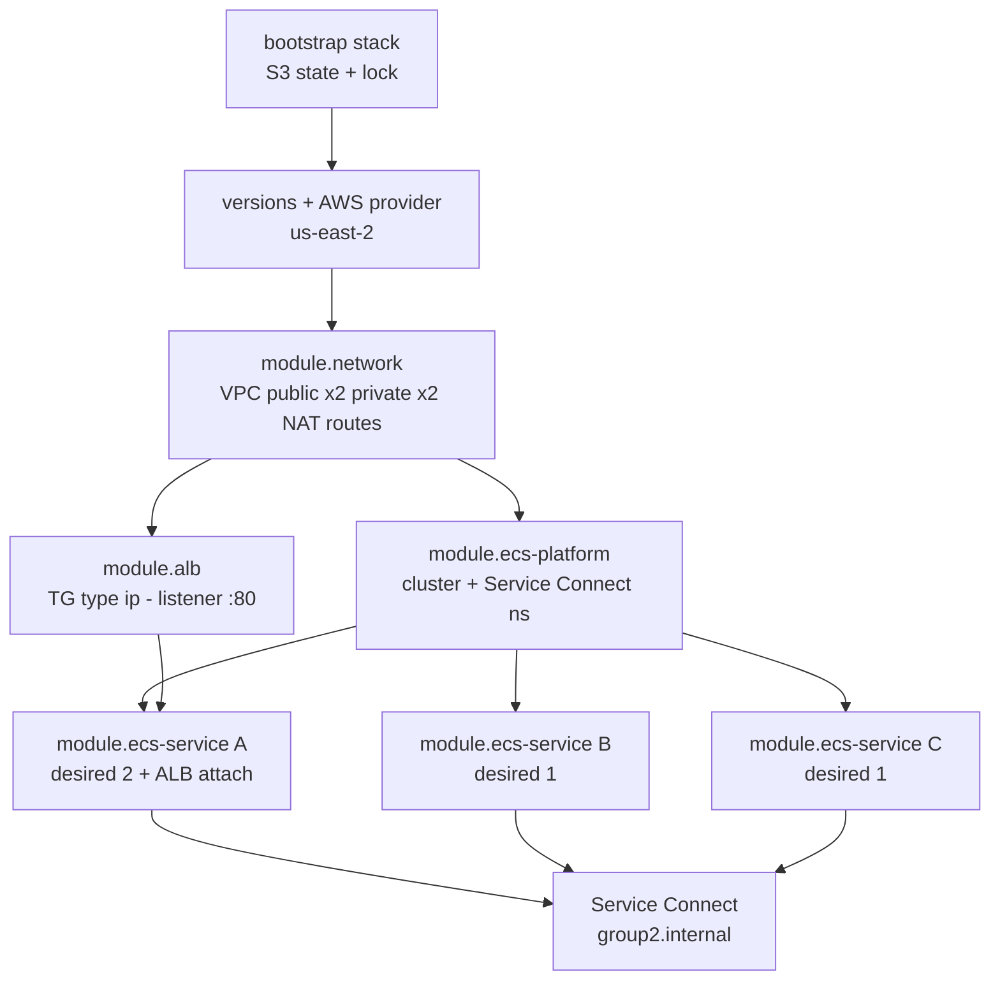

# GATE 1

## Design Before Creation

| Group | Region | Account |
|---|---|---|
| g2 | us-east-2 (Ohio) | 827478161993 |

| Members | Date |
|---|---|
| Patricia & Pearl | 2026-08-03 |

---

## 1. Dependency Graph and Ownership Map

### Module Dependency Order

1. `network` → `alb`, `ecs-platform`
2. `ecs-platform` → `ecs-service` (A, B, C)
3. `alb` → `ecs-service` (A only, for target group attachment)



**Runtime:** `Internet → ALB :80 → Service A → Service B → Service C` (by Service Connect name, no task IPs)

### Ownership Rotation (2-Person Adaptation)

With only two engineers, ownership rotates across all three cycles to prevent either person from becoming a single point of knowledge failure.

<table>
<thead>
<tr><th>Role</th><th>Responsibilities</th><th>Cycle 1 (Discover)</th><th>Cycle 2 (Teach)</th><th>Cycle 3 (Operate)</th></tr>
</thead>
<tbody>
<tr><td>Platform Owner</td><td>Backend, providers, VPC, subnets, routes, ECS cluster, Service Connect namespace, ALB, shared IAM, CI workflow</td><td>Patricia</td><td>Pearl</td><td>Patricia</td></tr>
<tr><td>Service A Owner</td><td>Service A ECR, module inputs, task def, log group, SG, ECS service, ALB registration, release evidence</td><td>Pearl</td><td>Patricia</td><td>Pearl</td></tr>
<tr><td>Service B Owner</td><td>Service B ECR, module inputs, task def, log group, SG, ECS service, release evidence</td><td>Patricia</td><td>Pearl</td><td>Patricia</td></tr>
<tr><td>Service C Owner</td><td>Service C ECR, module inputs, task def, log group, SG, ECS service, release evidence</td><td>Pearl</td><td>Patricia</td><td>Pearl</td></tr>
<tr><td>Release Owner</td><td>Plan summary, approval evidence, image SHA selection, runtime release proof, rollback evidence</td><td>Patricia</td><td>Pearl</td><td>Pearl</td></tr>
</tbody>
</table>

**Rule:** Whoever operates the terminal in a cycle cannot be the coach. In Cycle 2, the Cycle 1 operator becomes the coach and may only ask questions — no keyboard, no commands, no copied state files.

---

## 2. CIDR and Subnet Capacity Table

| Subnet Name | AZ | CIDR | Usable IPs | Purpose |
|---|---|---|---|---|
| devops-g2-public-2a | us-east-2a | 10.2.0.0/20 | 4,091 | ALB, NAT GW |
| devops-g2-public-2b | us-east-2b | 10.2.16.0/20 | 4,091 | ALB, NAT GW |
| devops-g2-private-app-2a | us-east-2a | 10.2.32.0/19 | 8,187 | Fargate tasks |
| devops-g2-private-app-2b | us-east-2b | 10.2.64.0/19 | 8,187 | Fargate tasks |

**VPC CIDR:** `10.2.0.0/16` (Group 2 gets `10.2.x.x` to avoid collision)

### Rolling Headroom

`awsvpc` mode = 1 ENI per task. Desired counts: A=2, B=1, C=1. Rolling deployment doubles A to 4. Peak = 6 ENIs. A `/19` provides 8,187 IPs per AZ — 99.9% headroom.

---

## 3. Route Table and Egress Design

| Route Table | Subnets | Destination | Target | Purpose |
|---|---|---|---|---|
| devops-g2-public-rt | public-2a, public-2b | 0.0.0.0/0 | IGW | ALB ingress + NAT placement |
| devops-g2-private-rt-2a | private-app-2a | 0.0.0.0/0 | NAT GW 2a | Task outbound from 2a |
| devops-g2-private-rt-2b | private-app-2b | 0.0.0.0/0 | NAT GW 2b | Task outbound from 2b |

### Egress Decision: NAT Gateway per AZ

**Risk reduced:** single NAT Gateway (or single AZ) failure cutting off all outbound connectivity. With one NAT GW per AZ, if us-east-2a fails, tasks in 2b still reach ECR/CloudWatch.

**Trade-off:** ~$90/month ($0.045/hr × 2). For a lab environment, this is acceptable for demonstrating production patterns.

**Alternative (cost-aware badge):** Single NAT GW in us-east-2a saves $45/month but creates AZ dependency. Document this trade-off explicitly if choosing single NAT.

### VPC Endpoints (optional)

- `com.amazonaws.us-east-2.ecr.dkr`
- `com.amazonaws.us-east-2.ecr.api`
- `com.amazonaws.us-east-2.logs`
- `com.amazonaws.us-east-2.ssmmessages` (ECS Exec)

---

## 4. Security Group Matrix and Traffic Contract

| Security Group | Ingress From | Port | Notes |
|---|---|---|---|
| devops-g2-alb-sg | 0.0.0.0/0 | 80 | Internet → ALB only |
| devops-g2-service-a-sg | devops-g2-alb-sg | app-port | ALB → A only |
| devops-g2-service-b-sg | devops-g2-service-a-sg | app-port | A → B only |
| devops-g2-service-c-sg | devops-g2-service-b-sg | app-port | B → C only |

### Explicit Denies (proven by absence of rules)

- Internet → Service B: **DENY** (no ALB listener, no public IP)
- Internet → Service C: **DENY**
- Service A → Service C directly: **DENY** (no SG rule)
- Service B → Service A: **DENY** (no reverse rule)
- Service C → Any outbound: **DENY** (no egress rules)

All rules use `source_security_group_id`. No CIDR blocks, no IP allowlists, no `0.0.0.0/0` on application ports.

---

## 5. Expected Resource Names and Tags

| Resource | Expected Name | Owner Tag |
|---|---|---|
| VPC | devops-g2-vpc | platform |
| Public subnet 2a | devops-g2-public-2a | platform |
| Public subnet 2b | devops-g2-public-2b | platform |
| Private app subnet 2a | devops-g2-private-app-2a | platform |
| Private app subnet 2b | devops-g2-private-app-2b | platform |
| Internet Gateway | devops-g2-igw | platform |
| NAT Gateway 2a | devops-g2-nat-2a | platform |
| NAT Gateway 2b | devops-g2-nat-2b | platform |
| ALB | devops-g2-alb | platform |
| ALB SG | devops-g2-alb-sg | platform |
| Target Group (A) | devops-g2-service-a-tg | service-a |
| ECS Cluster | devops-g2-cluster-iac | platform |
| Service Connect NS | group2.internal | platform |
| CloudWatch Log A | /ecs/devops-g2-service-a | service-a |
| CloudWatch Log B | /ecs/devops-g2-service-b | service-b |
| CloudWatch Log C | /ecs/devops-g2-service-c | service-c |
| ECS Service A | devops-g2-service-a | service-a |
| ECS Service B | devops-g2-service-b | service-b |
| ECS Service C | devops-g2-service-c | service-c |
| ECR Repo A | devops-g2-service-a | service-a |
| ECR Repo B | devops-g2-service-b | service-b |
| ECR Repo C | devops-g2-service-c | service-c |

### Mandatory Tags (every resource)

```hcl
tags = {
  Project     = "devops-g2"
  Group       = "g2"
  Owner       = "platform" | "service-a" | "service-b" | "service-c" | "release"
  Environment = "lab"
}
```

---

## 6. Three Predicted Broken Dependency Edges

### Edge #1: ALB → Service A health check fails

**Symptom:** Browser/ALB returns 502 Bad Gateway; app unreachable.

**AWS Evidence:** ECS console: tasks RUNNING; ALB Target Group: targets unhealthy; CloudWatch `UnHealthyHostCount` > 0; check container port matches TG port.

### Edge #2: Service A → Service B via Service Connect

**Symptom:** Service A logs: "getaddrinfo ENOTFOUND service-b" or connection timeout.

**AWS Evidence:** CloudWatch Logs (A): DNS failure; AWS Cloud Map: service-b not registered in `group2.internal`; ECS Service Connect tab: no service-b endpoint.

### Edge #3: Task Execution Role cannot pull from ECR

**Symptom:** Tasks stuck PENDING → STOPPED (never reaches RUNNING).

**AWS Evidence:** ECS Events: "CannotPullContainerError: error pulling image configuration"; CloudTrail: `ecr:BatchGetImage` / `ecr:GetAuthorizationToken` AccessDenied; IAM policy simulator test.

---

## 7. State Backend Design

### Bootstrap Stack (`infra/bootstrap/`)

Applied ONCE. Never destroyed with workload. Separate directory, separate state file.

| Resource | Name | Configuration |
|---|---|---|
| S3 Bucket | devops-g2-tfstate-827478161993 | us-east-2, versioning, SSE-KMS, public blocked |
| DynamoDB | devops-g2-tfstate-lock | us-east-2, PK LockID, on-demand |
| KMS Key | devops-g2-tfstate-key | us-east-2, symmetric, auto-rotate |

### Workload Backend (`infra/environments/lab/backend.tf`)

```hcl
terraform {
  backend "s3" {
    bucket         = "devops-g2-tfstate-827478161993"
    key            = "lab/workload.tfstate"
    region         = "us-east-2"
    encrypt        = true
    kms_key_id     = "arn:aws:kms:us-east-2:827478161993:key/f9dc8f90-f327-49a1-b403-f054ebc66798"
    dynamodb_table = "devops-g2-tfstate-lock"
  }
}
```

### Safety Rules

1. Backend state is in a separate directory with its own state file (local is acceptable for bootstrap only).
2. Workload state is NEVER local.
3. Workload destruction does NOT touch bootstrap resources.
4. `.terraform/`, `*.tfstate*`, `.terraform.lock.hcl` are in `.gitignore` — but the lock file SHOULD be committed for version pinning.

---

## 8. Application Release Ownership

| Step | Actor | Action | Evidence |
|---|---|---|---|
| 1 | Service Owner | Code change, tests pass | CI / local tests green |
| 2 | Service Owner | Build docker image with Git SHA tag | `docker images` shows SHA tag |
| 3 | Service Owner | Push to ECR | ECR console: image manifest with SHA |
| 4 | Release Owner | Update `image_tag` variable in IaC | Git diff shows SHA change |
| 5 | Release Owner | `terraform plan` | Plan shows task def revision update only |
| 6 | Release Owner | Review & apply | ECS deployment starts; circuit breaker active |
| 7 | Release Owner | Runtime proof | `curl <alb-dns>` returns Git SHA |
| 8 | Release Owner | Clean follow-up plan | `terraform plan` shows No changes |

### Rollback

Revert SHA variable commit → plan shows rollback to previous task def revision → apply → ECS rolling deploys previous version.

---

## 9. Five Architecture Decision Cards

### 1. Two Availability Zones

**Risk reduced:** Single AZ failure takes the app offline.

**Trade-off:** Double subnet/NAT infrastructure; more Terraform complexity.

**Pillar:** Reliability

**Evidence:** `aws ecs describe-services` shows tasks in us-east-2a and us-east-2b; ALB target health checks pass in both AZs.

### 2. Private Fargate Tasks (no public IPs)

**Risk reduced:** Direct internet exposure of containers; lateral movement if compromised.

**Trade-off:** Requires NAT Gateway or VPC endpoints for ECR pull and CloudWatch logs.

**Pillar:** Security

**Evidence:** `aws ecs describe-tasks` → `"assignPublicIp": "DISABLED"`; Terraform validation rejects `assign_public_ip = true`.

### 3. Security-Group References (not IP allowlists)

**Risk reduced:** Task IP churn during scaling breaks static rules; overly permissive CIDRs.

**Trade-off:** Modules become coupled (SG ID outputs → inputs); harder to trace than reading a CIDR.

**Pillar:** Security

**Evidence:** SG rules show `source_security_group_id`; no `cidr_blocks` on app ports; Terraform precondition rejects `0.0.0.0/0`.

### 4. Immutable Image SHA Tags

**Risk reduced:** "latest" tag ambiguity; untraceable deployments; rollbacks impossible.

**Trade-off:** Every code change requires IaC variable update + apply; cannot deploy by re-tagging latest.

**Pillar:** Operational Excellence

**Evidence:** ECR image tagged with Git SHA; task definition shows same SHA; ALB response includes SHA; variable validation rejects `"latest"`.

### 5. Remote, Versioned, Locked State

**Risk reduced:** Local state loss; concurrent applies corrupting infrastructure; no change audit trail.

**Trade-off:** Bootstrap stack is a permanent prerequisite; state locking adds ~1–2s per operation.

**Pillar:** Operational Excellence

**Evidence:** S3 versioning shows multiple state file versions; DynamoDB `LockID` shows active lock during apply; any engineer can `terraform init` and get identical state.

---

## 10. Repository Shape

```
devops-g2-lab/
├── service-a/
│   ├── Dockerfile
│   ├── app.py
│   └── buildspec.yml
├── service-b/
│   ├── Dockerfile
│   ├── app.py
│   └── buildspec.yml
├── service-c/
│   ├── Dockerfile
│   ├── app.py
│   └── buildspec.yml
├── buildspecs/
│   └── common-buildspec.yml
├── infra/
│   ├── bootstrap/
│   │   ├── main.tf
│   │   ├── variables.tf
│   │   └── outputs.tf
│   ├── environments/
│   │   └── lab/
│   │       ├── main.tf
│   │       ├── variables.tf
│   │       ├── outputs.tf
│   │       ├── backend.tf
│   │       └── terraform.tfvars
│   ├── modules/
│   │   ├── network/
│   │   │   ├── main.tf
│   │   │   ├── variables.tf
│   │   │   └── outputs.tf
│   │   ├── alb/
│   │   │   ├── main.tf
│   │   │   ├── variables.tf
│   │   │   └── outputs.tf
│   │   ├── ecs-platform/
│   │   │   ├── main.tf
│   │   │   ├── variables.tf
│   │   │   └── outputs.tf
│   │   └── ecs-service/
│   │       ├── main.tf
│   │       ├── variables.tf
│   │       └── outputs.tf
│   └── tests/
│       └── architecture.tftest.hcl
└── docs/
    ├── gate1-design.md
    └── runbook.md
```

---

## 11. Immediate Action Plan

| Time | Task | Owner |
|---|---|---|
| 0–10m | Create repo structure; initialize `infra/bootstrap/` | Patricia |
| 10–20m | Write bootstrap Terraform; `terraform init && apply` | Patricia |
| 20–30m | Write `modules/network` (VPC, 4 subnets, IGW, 2 NAT, routes) | Pearl |
| 30–40m | Write `modules/alb` and `modules/ecs-platform` | Patricia |
| 40–50m | Write `modules/ecs-service` (reusable); instantiate A, B, C | Pearl |
| 50–60m | First `terraform plan` in `environments/lab`; document first failure | Both |
