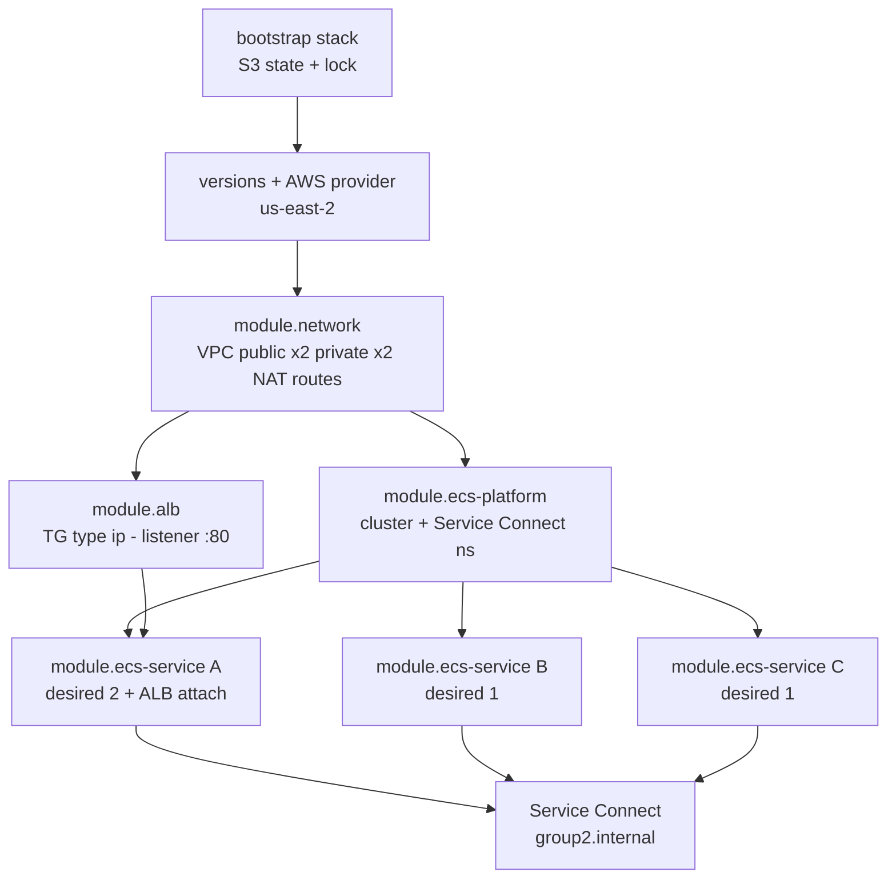

# 1. Dependency graph (IaC greenfield) — Group 2

Workload runs in a **custom VPC** with **private** Fargate tasks (no public IPs). Old console cluster `devops-g2-cluster` is out of scope — IaC must not destroy it.

| Role | Service | Port | Discovery name |
|---|---|---|---|
| Service A | service-a | 3000 | `service-a-iac` |
| Service B | service-b | 3002 | `service-b-iac` |
| Service C | service-c | 3003 | `service-c-iac` |

Service Connect namespace: `group2.internal`
IaC cluster: `devops-g2-cluster-iac`

## Module dependency graph

**Runtime:** `Internet → ALB :80 → A :3000 → B :3002 → C :3003`
**Extra app edge:** `C → A :3000 /greeting-rcvd` (async callback, correctly blocked by the traffic contract — see scar log)

## If an edge is missing

| Edge | If broken |
|---|---|
| Bootstrap → workload backend | No shared remote state / locking; each engineer risks a divergent local state file |
| Network → private subnets | Tasks cannot place without public IPs |
| Network → NAT / routes | Cannot pull ECR images or write CloudWatch logs |
| Execution role → ECR/logs | Task start fails (`CannotPullContainerError`) |
| Platform → cluster / namespace | No services; no Service Connect names to resolve |
| ECR → image SHA | Nothing immutable to deploy |
| ALB → TG → Service A | Public path fails / health checks fail |
| Service A SG → Service B SG | A→B path fails |
| Service B SG → Service C SG | B→C path fails |
| Missing deny A → C | Security contract fails |

## Dependency questions

**Before a Fargate task can start:** remote state, custom VPC, private subnets in 2 AZs, NAT egress, security group, cluster, task definition with SHA-tagged image, execution role, image already in ECR, `assign_public_ip = false`.

**Before ECS can pull an image:** ECR repo with the SHA tag pushed, execution role's ECR pull permissions, private subnet → NAT → ECR network path.

**Before the ALB can route:** ALB in at least two public subnets, listener on :80, target group type `ip`, healthy Service A targets, security group rules Internet→ALB and ALB→Service A.

**Survives task replacement:** VPC, subnets, NAT Gateways, ALB, target group, cluster, service, task-definition family, ECR image, security groups, log groups, IAM roles, state backend. Task ENI/IP do not.

**Costs while idle:** two NAT Gateways, ALB, running Fargate tasks, CloudWatch Logs, ECR storage. Destroy the workload after demos; keep the bootstrap state bucket.
