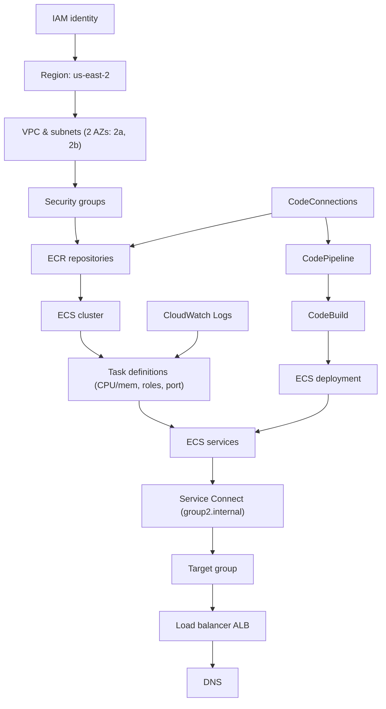

# Gate 1 Submission — ECS on Fargate Lab

**Group 2** | **Region:** us-east-2 | No AWS resources created before this review

---

## 1. Ownership map

| Member | Owns |
|---|---|
| Patricia (Person A) | Platform (ECS cluster, Service Connect namespace, ALB, CodeConnections) + Service A |
| Pearl (Person B) | Service B + Service C |

Rule: each owner may advise on another member's service but never operates their console. With two members, the platform role is not rotated separately — Patricia holds Platform alongside Service A.

---

## 2. Dependency graph

**Attached branches:**
- **CloudWatch Logs** — attached to Task definitions (where container log output is configured).
- **CI/CD pipeline** — CodeConnections → CodePipeline → CodeBuild → feeds a new image into ECR; the resulting ECS deployment feeds into ECS services. Each service (A, B, C) will have its own CodeBuild project and buildspec, all sharing the one CodeConnections connection.

---

## 3. Dependency questions (Section 1.2)

| Question | Team answer |
|---|---|
| What must exist before a Fargate task can start? | Registered task definition, ECS cluster, VPC subnets, a security group, and an execution role with permission to pull images and write logs. |
| What must exist before ECS can pull an image? | The ECR repository with the image already pushed, the execution role's ECR permissions, and an outbound network path (public IP, since no NAT gateway is used in this lab). |
| What must exist before the ALB can route traffic? | The ALB itself, a listener on port 80, a target group, the target group registered with Service A's ECS service, and targets passing health checks. |
| What depends on the named container port? | The task definition's port mapping, the Service Connect service name/port mapping, the target group's port, and the matching security-group rule. |
| Which resources survive task replacement? | ECR images, task definition revisions, security groups, the ALB, target group, Service Connect namespace, and CloudWatch log group. Task IPs do not survive — Service Connect and SG-by-reference rules are what keep working after a replacement. |
| Which resources generate cost while idle? | Fargate tasks (billed for allocated vCPU/memory while running) and the ALB (hourly charge) are the expensive ones. CloudWatch Logs storage/ingestion adds a smaller ongoing cost. The ECS cluster, security groups, and ECR repository itself (empty) do not bill while idle. |

---

## 4. Failure predictions

| Broken edge | Expected user symptom | Expected AWS evidence |
|---|---|---|
| ECS → ECR | Task never starts | Image pull error in ECS service events |
| ALB → Service A | 502/504 from browser | Unhealthy target in target group health checks |
| Service A → Service B (SG misconfigured) | A's request to B times out | No matching security-group rule; timeout via ECS Exec test |

---

## 5. Traffic contracts

Protocol is HTTP throughout. Health endpoint is `/health` on every service. Timeout matches `curl --max-time 5` used in later test phases, so 5 seconds is used consistently below.

| Source | Destination | Protocol | Port | Service name | Health endpoint | Timeout | Allowed? | Enforcement |
|---|---|---|---|---|---|---|---|---|
| Internet | ALB | HTTP | 80 | n/a | n/a | n/a | Yes | ALB security group |
| Internet | Service A | HTTP | app port | service-a | /health | 5s | No | No inbound SG rule |
| Internet | Service B | HTTP | app port | service-b | /health | 5s | No | No inbound SG rule |
| Internet | Service C | HTTP | app port | service-c | /health | 5s | No | No inbound SG rule |
| ALB | Service A | HTTP | app port (A) | service-a | /health | 5s | Yes | ALB SG → A SG |
| Service A | Service B | HTTP | internal port | service-b | /health | 5s | Yes | A SG → B SG |
| Service A | Service C | HTTP | internal port | service-c | /health | 5s | No | No matching rule |
| Service B | Service C | HTTP | internal port | service-c | /health | 5s | Yes | B SG → C SG |

No other application path is permitted — the only allowed edges are Internet→ALB, ALB→A, A→B, and B→C.

---

## 6. Resource naming & tags

**Prefix:** `devops-g2-` | **Region:** us-east-2 (checked at every login)

| Resource | Name |
|---|---|
| ECS cluster | `devops-g2-cluster` |
| Service Connect namespace | `group2.internal` (see note below) |
| ECR repositories | `devops-g2-service-a` / `-b` / `-c` |
| Security groups | `devops-g2-alb-sg`, `devops-g2-service-a/b/c-sg` |
| Target group | `devops-g2-tg` |
| Application Load Balancer | `devops-g2-alb` |

Required tags on every resource: `Project=devops-mentorship`, `Group=group-2`, `Owner=<role e.g. platform-owner, service-a-owner>`, `Environment=lab`.

**Namespace naming decision:** using `group2.internal` per the assignment's example format (Section 3.1: *"Create: group<group-number>.internal"*), rather than the `devops-g2-` resource prefix, since a Service Connect namespace is a DNS namespace rather than a taggable AWS resource. Flagged to the instructor for confirmation before creation.

---

**No AWS resources exist yet. Awaiting Gate 1 approval before Phase 2 (Host It) begins.**
